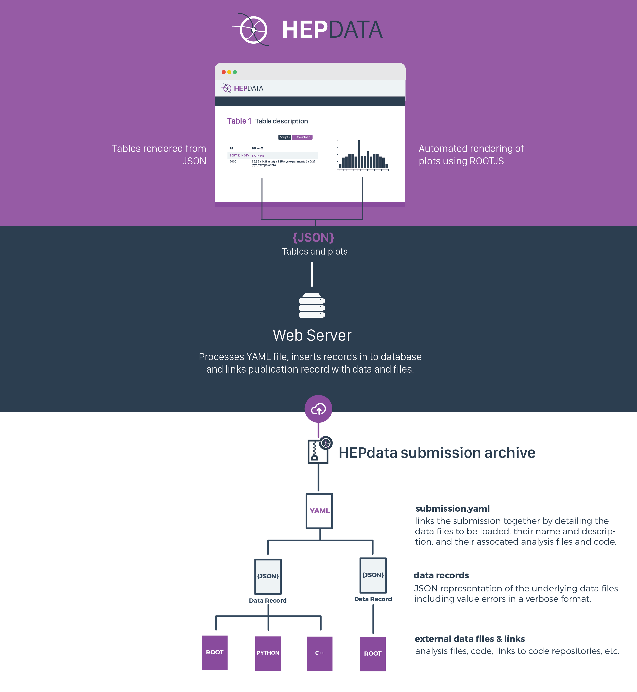
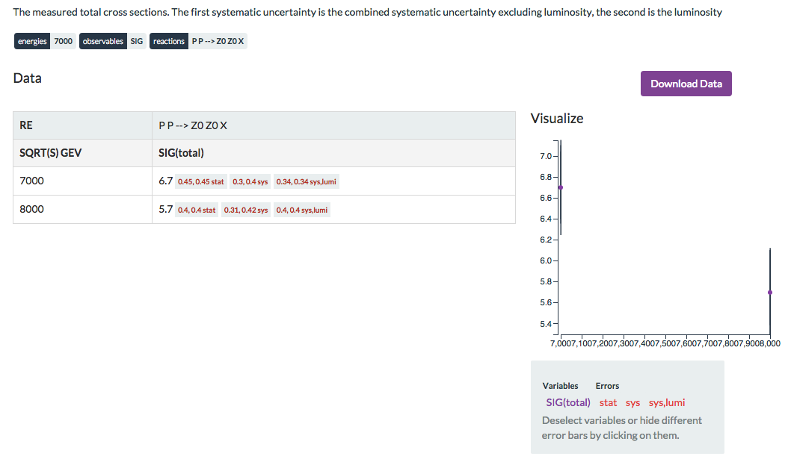

# HEP Data Submission

HEP data submission will largely involve the upload of archives that specify the data associated with a publication.

The main file for a submission is the *submission.yaml* file.
This links together all the data in to one submission and defines files such as scripts used to create the data, ROOT files, or even links to Github/Bitbucket/Zenodo etc. for more substantial pieces of code.

An additional important type of file is the data file that defines all the data, qualifiers, error bars, etc.

 

## Submission.yaml


``` yaml

# Start a new submission. This section is optional for the provision of information about the overall submission.
references: # Additional references (e.g. experiment TWiki page for analysis)
  - http://atlas.web.cern.ch/Atlas/GROUPS/PHYSICS/PAPERS/STDM-2012-02/
comment: | # Information that applies to all data tables.
  CERN-LHC.  Measurements of the cross section  for ZZ production using the 4l and 2l2nu decay channels in proton-proton collisions at a centre-of-mass energy of 7 TeV with 4.6 fb^-1 of data collected in 2011.  The final states used are 4 electrons, 4 muons, 2 electrons and 2 muons, 2 electrons and missing transverse momentum, and 2 muons and missing transverse momentum (MET).

  The cross section values reported in the tables should be multiplied by a factor of 1.0141 to take into account the updated value of the integrated luminosity for the ATLAS 2011 data taking period.  The uncertainty on the global normalisation ("Lumi") remains at 1.8%.  See Eur.Phys.J. C73 (2013) 2518 for more details.

  The 4l channel fiducial region is defined as:
  - 4e, 4mu or 2e2mu
  - Ambiguities in pairing are resolved by choosing the combination that results in the smaller value of the sum |mll - mZ| for the two pairs, where mll is the mass of the dilepton system.
  - ptLepton > 7 GeV (at least one with ptLepton > 20 (25) GeV for muons (electrons))
  - |etaLepton| < 3.16
  - At least one lepton pair is required to have invariant mass between 66 and 116 GeV. If the second pair also satisfies this, the event is ZZ, otherwise if the second pair satisfies mll > 20 GeV it is ZZ*.
  - min(DeltaR(l,l)) > 0.2.

  The 2l2nu channel fiducial region is defined as:
  - 2e+MET or 2mu+MET
  - ptLepton > 20 GeV
  - |etaLepton| < 2.5
  - mll must be between 76 and 106 GeV
  - -MET*cos(phi_METZ)>75 GeV, where phi_METZ is the angle between the Z and the MET
  - |MET - pTZ| / pTZ < 0.4, where pTZ is the transverse momentum of the dilepton system
  - No events with a jet for which ptJet > 25 GeV and |etaJet| < 4.5
  - No events with a third lepton for which ptLepton > 10 GeV
  - min(DeltaR(l,l)) > 0.3

---
# Start of table entries
# This is Table 1.
name: "Table 1"
location: Page 17 of preprint
description: The measured fiducial cross sections.  The first systematic uncertainty is the combined systematic uncertainty excluding luminosity, the second is the luminosity
keywords: # used for searching, possibly multiple values for each keyword
  - { name: reactions, value: [P P --> Z0 Z0 X]}
  - { name: observables, value: [SIG]}
  - { name: energies, value: [7000]}
data_file: data1.yaml
additional_resources:
  - location: "http:github.com/HEPData/hepdata"
    description: "Full source code for creating this data"
  - location: "root.root"
    description: "Some file"

---
# This is Table 2.
name: "Table 2"
location: Page 20 of preprint
description: The measured total cross sections.  The first systematic uncertainty is the combined systematic uncertainty excluding luminosity, the second is the luminosity
keywords: # used for searching, possibly multiple values for each keyword
  - { name: reactions, value: [P P --> Z0 Z0 X]}
  - { name: observables, value: [SIG]}
  - { name: energies, value: [7000]}
data_file: data2.yaml

---
# This is Table 3.
name: "Table 3"
location: Figure 8A
description: Normalized ZZ fiducial cross section (multiplied by 10^6 for readability) in bins of the leading reconstructed dilepton pT for the 4 lepton channel.  The first systematic uncertainty is detector systematics, the second is background systematic uncertainties
keywords: # used for searching, possibly multiple values for each keyword
  - { name: reactions, value: [P P --> Z0 Z0 X]}
  - { name: observables, value: [DSIG/DPT]}
  - { name: energies, value: [7000]}
data_file: data3.yaml

```

### Data Files

Data Files can be encoded as either YAML or JSON, the software deals with both the same way.

#### YAML

``` yaml

---
xaxes:
  - header: {name: SQRT(S), units: GEV}
    bins:
      - value: 7000
      - value: 8000
yaxes:
  - header: {name: SIG(total), units: FB}
    qualifiers:
      - {name: RE, value: P P --> Z0 Z0 X}
    points:
      - value: 6.7
        errors:
          - {symerror: 0.45, label: stat}
          - {asymerror: {plus: 0.4, minus: 0.3}, label: sys}
          - {symerror: 0.34, label: "sys,lumi"}
      - value: 5.7
        errors:
          - {symerror: 0.4, label: stat}
          - {asymerror: {plus: 0.42, minus: 0.31}, label: sys}
          - {symerror: 0.4, label: "sys,lumi"}

```


#### JSON

``` json

{
    "xaxes": [
        {
            "header": {
                "name": "SQRT(S)",
                "units": "GEV"
            },
            "bins": [
                {
                    "value": 7000
                },
                {
                    "value": 8000
                }
            ]
        }
    ],
    "yaxes": [
        {
            "header": {
                "name": "SIG(total)",
                "units": "FB"
            },
            "qualifiers": [
                {
                    "name": "RE",
                    "value": "P P --> Z0 Z0 X"
                }
            ],
            "points": [
                {
                    "value": 6.7,
                    "errors": [
                        {"symerror": 0.45, "label": "stat"},
                        {"asymerror": {"plus": 0.4, "minus": 0.3}, "label": "sys"},
                        {"symerror": 0.34,"label": "sys,lumi"}
                    ]
                },
                {
                    "value": 5.7,
                    "errors": [
                        {"symerror": 0.4, "label": "stat"},
                        {"asymerror": {"plus": 0.42, "minus": 0.31}, "label": "sys"},
                        {"symerror": 0.4, "label": "sys,lumi"}
                    ]
                }
            ]
        }
    ]
}
```

#### Errors

There are two main classes of errors that can be encoded, symmetric errors, and asymmetric errors.
Symmetric errors allow you to specify a min and max error using one value, e.g. ```"symerror": 0.4```, will translate to min -0.4, max +0.4.
Unsurprisingly, an asymmetric error requires both plus and minus values to be explicitly encoded, e.g. ```"asymerror": {"plus": 0.4, "minus": 0.3}```.

#### How Does this translate when rendered by HEPdata?

Although perhaps not a very interesting example, the data table looks as follows in HEPdata.


