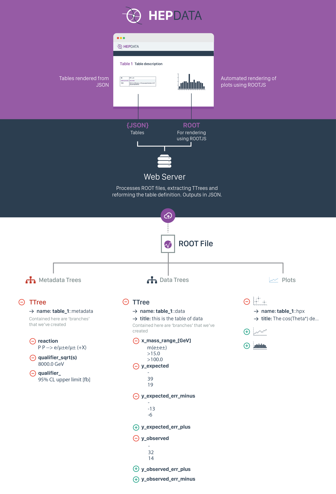
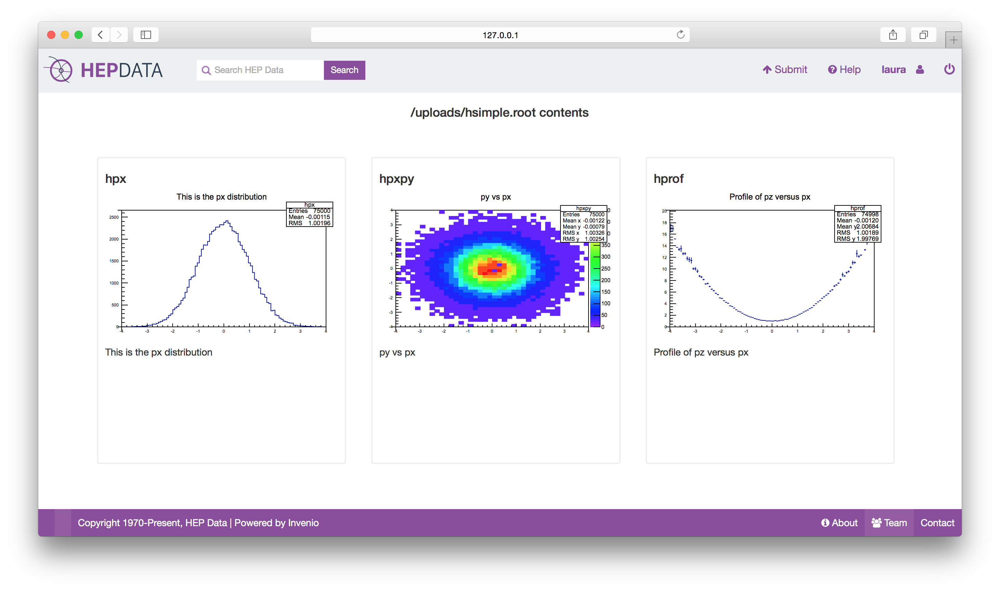
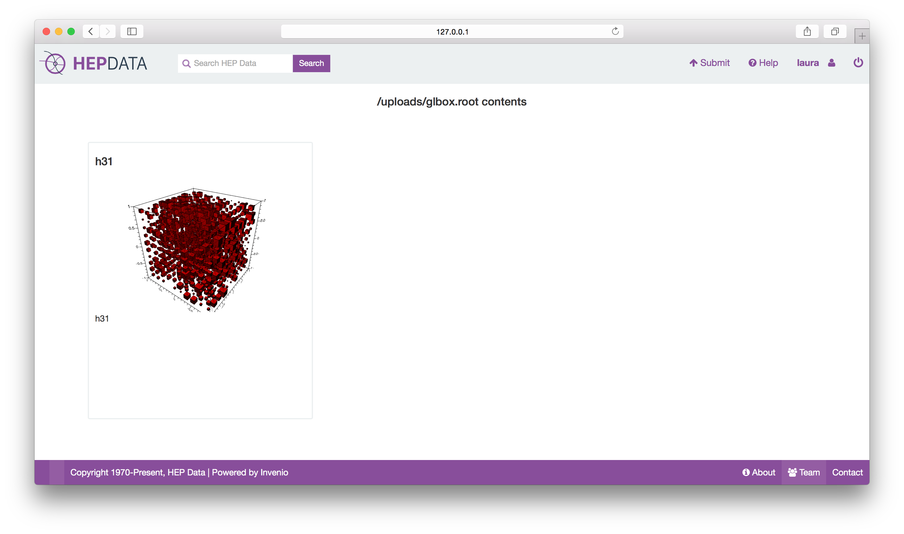
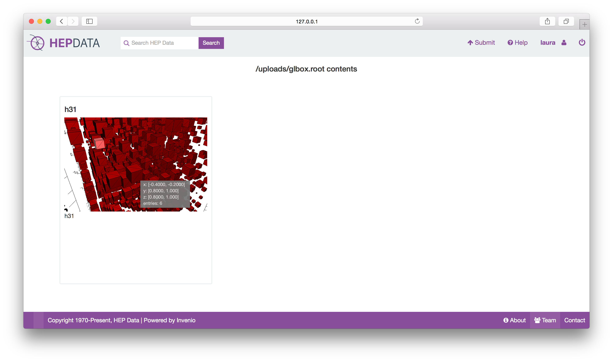

# HEP Data Submission

HEP data submission will largely involve the upload of ROOT files that specify the plots for the publication, and the data that underlay these plots.
It is unclear if ROOT will be completely suitable for the inclusion of data. This is a topic for discussion in the coming days.

However, there also needs to be an exchange format between the ROOT data extraction API and the front end to render the results. JSON would be used for this purpose regardless.



## Submission Format

The submission format would ideally be just via the ROOT files. These files should include the plots (that will be automatically plotted), and the data tables related to these plots.

The following representations are there to roughly model data in [Table 8](http://hepdata.cedar.ac.uk/view/ins1331782/d3) of [Aad, et. al, Search for anomalous production of prompt same-sign lepton pairs and pair-produced doubly charged Higgs bosons with s√=8 TeV pp collisions using the ATLAS detector, 2014](http://inspirehep.net/record/1331782).
More examples could be created to model other data tables, however our model defined below seems to represent the data tables we've so far observed in HEPData.

### ROOT Data Files

Creating [ROOT TTrees](https://root.cern.ch/root/html/TTree.html) is relatively easy. Formatting the data correctly is the hard part. We've tried to structure the tree to make it both easy to get the data in to the files, and to make it easy for us to reconstruct the data table following submission.

The ROOT file is arranged in to three parts that should be linked by a common name pattern, e.g. *table_1::metadata*, *table_1::data*, and *table_1::hpx* would link everything for *table_1* in the main interface.

- The metadata trees: these detail information about reactions and qualifiers for each table. Essentially, all of the information at the top section of the table in the current HEPData instance.
- The data trees: these store the essence of the data table, that being all of the X and Y values (and their error bar values).
- The plots.


** IN DRAFT **

```python

class DataValue(TreeModel):
    """
        For each value, we have its error on the X and Y axes
    """
    val = FloatCol()
    err_y_minus = FloatCol()
    err_y_plus = FloatCol()
    err_x_minus = FloatCol()
    err_x_plus = FloatCol()


class DataRecord(DataValue.prefix('x_'), DataValue.prefix('expected_'), DataValue.prefix('observed_')):
    i = IntCol()


class DataGenerator(object):

    def generate_root_file_with_tree(self, file_name, mode="update"):

        f = root_open(file_name, mode)
        trees = ["hpx", "hpxpy", "hprof"]

        for tree_name in trees:

            tree = Tree(name=tree_name, title=tree_name, model=DataRecord)
            # F - Float, I - Integer

            for i in xrange(1000):
                tree.x_val = gauss(1., 4.)
                tree.x_err_y_minus = gauss(0., 1)
                tree.x_err_y_plus = gauss(0., 1)

                tree.expected_val = gauss(1., 4.)
                tree.expected_err_y_minus = gauss(1., 4.)
                tree.expected_err_x_minus = gauss(1., 4.)

                tree.observed_val = gauss(1., 4.)
                tree.observed_err_y_minus = gauss(1., 4.)
                tree.observed_err_x_minus = gauss(1., 4.)

                tree.i = i
                tree.fill()

            tree.write()

        f.close()

```

## YAML and JSON Renderings

YAML may be a little more difficult to generate and parse than JSON, but it is generally seen as more readable than JSON. YAML could be used and then translated to JSON (or use JSON directly for the upload).
Moreover, JSON representations of the YAML can also be used (these were generated using the YAML parser [here](http://yaml-online-parser.appspot.com/).
We've created verbose and compact representations of the YAML files that vary how data records are represented.
For each YAML presentation, it's JSON equivalent is also given.

### Example 1: From [ins1331782](http://hepdata.cedar.ac.uk/view/ins1331782/d3)

#### YAML

```yaml

---
Table:
  name: "Table 3"
  title: "Upper limit at 95% CL on the fiducial cross section for ℓ±ℓ± pairs from non-SM signals. The expected limits and their 1σ uncertainties are given together with the observed limits derived from the data. Limits are given separately for the e±e±,e±μ± and μ±μ± channel inclusively and separated by charge."

  x:
     name: "mass range [GeV]"
     values: ["m($e^{\\pm}e^{\\pm}$"]

  reactions:
      - reaction: "P P --> $e/\\mu{\\pm} e/\\mu{\\pm}$ (+X)"
        qualifiers:
         - type: "sqrt(s)"
           value: "8000.0 GeV"
         - type: ""
           value: "95% CL upper limit [fb]"
        measurements:
        - name: "Expected"
          values:
          - value: 39
            errors:
            - label:
              err_minus: -13
              err_plus: 10
                        
```

#### JSON

Its JSON representation is pretty similar, and translates to this.


```json

{
  "Table": {
    "title": "Upper limit at 95% CL on the fiducial cross section for \u2113\u00b1\u2113\u00b1 pairs from non-SM signals. The expected limits and their 1\u03c3 uncertainties are given together with the observed limits derived from the data. Limits are given separately for the e\u00b1e\u00b1,e\u00b1\u03bc\u00b1 and \u03bc\u00b1\u03bc\u00b1 channel inclusively and separated by charge.",
    "name": "Table 3",

    "x": {
      "values": [
        "m($e^{\\pm}e^{\\pm}$"
      ],
      "name": "mass range [GeV]"
    },

    "reactions": [
      {
        "reaction": "P P --> $e/\\mu{\\pm} e/\\mu{\\pm}$ (+X)",
        "qualifiers": [
          {
            "type": "sqrt(s)",
            "value": "8000.0 GeV"
          },
          {
            "type": "",
            "value": "95% CL upper limit [fb]"
          }
        ],
        "measurements": [
          {
            "name": "Expected",
            "values": [
              {
                "errors": [
                  {
                    "err_plus": 10,
                    "err_minus": -13,
                    "label": null
                  }
                ],
                "value": 39
              }
            ]
          }
        ]
      }
    ]
  }
}

```

### Example 2: From [ins1203852](http://hepdata.cedar.ac.uk/view/ins1203852/d1)

#### YAML

```yaml

---
Table:
  name: "Table 3"
  title: "The measured fiducial cross sections. The first systematic uncertainty is the combined systematic uncertainty excluding luminosity, the second is the luminosity.."
  x:
    name: "SQRT(S) IN GEV"
    values: [7000.0]

  reactions:
    - reaction: "P P --> Z0 < LEPTON+ LEPTON- > Z0 < LEPTON+ LEPTON- > X"
      measurements:
      - name: "SIG(fiducial) IN FB"
        values:
          - value: 25.4
            errors:
            - label: stat
              err_minus: -3.0
              err_plus: 3.3
            - label: sys
              err_minus: -1.0
              err_plus: 1.2
            - label: sys,lumi
              err_minus: -1.0
              err_plus: 1

    - reaction: "P P --> Z0 < LEPTON+ LEPTON- > Z0* < LEPTON+ LEPTON- > X"
      measurements:
      - name: "SIG(fiducial) IN FB"
        values:
          - value: 29.8
            errors:
            - label: stat
              err_minus: -3.5
              err_plus: 3.8
            - label: sys
              err_minus: -1.5
              err_plus: 1.7
            - label: sys,lumi
              err_minus: -1.2
              err_plus: 1.2

    - reaction: "P P --> Z0 < LEPTON+ LEPTON- > Z0 < NU NUBAR > X"
      measurements:
      - name: "SIG(fiducial) IN FB"
        values:
          - value: 12.7
            errors:
            - label: stat
              err_minus: -2.9
              err_plus: 3.1
            - label: sys
              err_minus: -1.7
              err_plus: 1.7
            - label: sys,lumi
              err_minus: -0.5
              err_plus: 0.5


```

#### JSON

```json

{
  "Table": {

    "name": "Table 3",
    "title": "The measured fiducial cross sections. The first systematic uncertainty is the combined systematic uncertainty excluding luminosity, the second is the luminosity.",

    "x": {
      "name": "SQRT(S) IN GEV",
      "values": [
        7000.0
      ]
    },

    "reactions": [
      {
        "reaction": "P P --> Z0 < LEPTON+ LEPTON- > Z0 < LEPTON+ LEPTON- > X",
        "name": "SIG(fiducial) IN FB",
        "measurements": [
          {
            "values": [
              {
                "errors": [
                  {
                    "err_plus": 3.2999999999999998,
                    "err_minus": -3.0,
                    "label": "stat"
                  },
                  {
                    "err_plus": 1.2,
                    "err_minus": -1.0,
                    "label": "sys"
                  },
                  {
                    "err_plus": 1,
                    "err_minus": -1.0,
                    "label": "sys,lumi"
                  }
                ],
                "value": 25.399999999999999
              }
            ]
          }
        ]
      },
      {
        "reaction": "P P --> Z0 < LEPTON+ LEPTON- > Z0* < LEPTON+ LEPTON- > X",
        "name": "SIG(fiducial) IN FB",
        "measurements": [
          {
            "values": [
              {
                "errors": [
                  {
                    "err_plus": 3.7999999999999998,
                    "err_minus": -3.5,
                    "label": "stat"
                  },
                  {
                    "err_plus": 1.7,
                    "err_minus": -1.5,
                    "label": "sys"
                  },
                  {
                    "err_plus": 1.2,
                    "err_minus": -1.2,
                    "label": "sys,lumi"
                  }
                ],
                "value": 29.800000000000001
              }
            ]
          }
        ]
      },
      {
        "reaction": "P P --> Z0 < LEPTON+ LEPTON- > Z0 < NU NUBAR > X",
        "name": "SIG(fiducial) IN FB",
        "measurements": [
          {
            "values": [
              {
                "errors": [
                  {
                    "err_plus": 3.1000000000000001,
                    "err_minus": -2.8999999999999999,
                    "label": "stat"
                  },
                  {
                    "err_plus": 1.7,
                    "err_minus": -1.7,
                    "label": "sys"
                  },
                  {
                    "err_plus": 0.5,
                    "err_minus": -0.5,
                    "label": "sys,lumi"
                  }
                ],
                "value": 12.699999999999999
              }
            ]
          }
        ]
      }
    ]
  }
}


```


## Viewing the ROOT Files

We will use ROOTJS to render the data.







